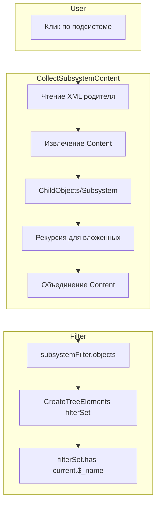

# Анализ: фильтр по подсистеме не применяется к общим модулям

## Корневая причина

**Общие модули в 1С чаще всего находятся во вложенных подсистемах, а не в родительской.** Родительская подсистема может не содержать `CommonModule` в своём `Content` — они указаны в `Content` дочерних подсистем (`ChildObjects/Subsystem`).

## Подтверждение на XML E:\DATA1C\RZDZUP\src\cf\Subsystems


| Подсистема                                       | Content                                                                                                                                                      | ChildObjects                                                  |
| ------------------------------------------------ | ------------------------------------------------------------------------------------------------------------------------------------------------------------ | ------------------------------------------------------------- |
| **ibs_РасчетПоказателейПремирования** (родитель) | 14 объектов: Document, Role, ChartOfCharacteristicTypes, Constant, FunctionalOption, InformationRegister, AccumulationRegister, Report. **Нет CommonModule** | ibs_НастройкиРасчетаПоказателей                               |
| **ibs_НастройкиРасчетаПоказателей** (вложенная)  | 34 объекта, включая **7 CommonModule** (ibs_МодульПремированияРасширенный, ibs_МодульПремированияВызовСервера и др.)                                         | пусто                                                         |
| **Зарплата** (корневая)                          | Document, Report, CommonPicture, CommonCommand и др. **Нет CommonModule**                                                                                    | АнализЗарплаты, Бухучет, Удержания, УчетРабочегоВремени и др. |


## Поток данных фильтра




## Ключевые точки в коде

### 1. CollectSubsystemContent ([metadataView.ts](d:\Docker\app\MetaDataViewer_v3\src\metadataView.ts) ~2769)

- Читает XML подсистемы по путям `Subsystems/Parent.xml` и `Subsystems/Parent/Subsystems/Child.xml`
- Парсит `Content` (`xr:Item` с `#text` или `ref`)
- Рекурсивно обрабатывает `ChildObjects/Subsystem` (строки 2899–2916)
- Путь к вложенной: `Subsystems/ibs_РасчетПоказателейПремирования/Subsystems/ibs_НастройкиРасчетаПоказателей.xml`

### 2. CreateTreeElements ([metadataView.ts](d:\Docker\app\MetaDataViewer_v3\src\metadataView.ts) ~2171)

- `filterSet = new Set(subsystemFilter)` — объекты из Content
- Общие модули попадают в дерево только при `filterSet.has(current.$_name)` (строка 2178)
- `current.$_name` для общих модулей: `CommonModule.ibs_МодульПремированияРасширенный`

### 3. Формат XML Content

```xml
<xr:Item xsi:type="xr:MDObjectRef">CommonModule.ibs_МодульПремированияРасширенный</xr:Item>
```

Ссылка в тексте элемента. Код использует `contentElem["#text"]` (строка 2883).

## Возможные причины отсутствия общих модулей


| Причина                            | Вероятность | Описание                                                                                                                                                                                                                                                                                       |
| ---------------------------------- | ----------- | ---------------------------------------------------------------------------------------------------------------------------------------------------------------------------------------------------------------------------------------------------------------------------------------------- |
| **A. Путь к вложенной подсистеме** | Высокая     | `treeItemPath` для вложенной подсистемы при клике по ней может формироваться неверно. В [плане a2c0124a](d:\Docker\app\MetaDataViewer_v3.cursor\plans\фильтр_подсистемы_роли_и_модули_a2c0124a.plan.md): для `Subsystem.A.B` получается `Subsystems/A/B`, а нужен `Subsystems/A/Subsystems/B`. |
| **B. element.id vs rootPath**      | Средняя     | `element.id` — абсолютный путь к cf (например, `E:/DATA1C/RZDZUP/src/cf`). `rootPath` — workspace root. При `pathJoin(rootFsPath, ...pathDirectNormalized)` с абсолютным путём в `pathDirectNormalized` логика может давать неверный путь.                                                     |
| **C. Парсинг Content**             | Низкая      | fast-xml-parser с `textNodeName: '#text'` должен класть текст в `#text`. Для `<xr:Item>CommonModule.X</xr:Item>` результат: `{ "#text": "CommonModule.X" }`.                                                                                                                                   |
| **D. Кэш**                         | Средняя     | Fingerprint включает фильтр (`sf:${currentFilter.join(',')}`). Устаревший кэш может подставлять дерево без учёта фильтра.                                                                                                                                                                      |
| **E. ConfigDumpInfo.Metadata**     | Низкая      | Если `versionMetadata` не содержит общих модулей, они не появятся в дереве независимо от фильтра.                                                                                                                                                                                              |


## Рекомендуемые шаги диагностики

1. **Включить debugMode** (`metadataViewer.debugMode: true`) — логи `[CollectSubsystemContent]` покажут, сколько объектов и CommonModule попало в фильтр.
2. **Проверить commandArguments** при клике по родительской подсистеме — должны быть объекты из вложенной (в т.ч. CommonModule).
3. **Проверить путь к вложенной подсистеме** — при рекурсии `nestedPath` должен вести к существующему файлу `Subsystems/ibs_РасчетПоказателейПремирования/Subsystems/ibs_НастройкиРасчетаПоказателей.xml`.
4. **Инвалидировать кэш** — удалить `.cache-bsl` и перезагрузить дерево с фильтром.

## План исправлений (если диагностика подтвердит)

1. **Путь к вложенной подсистеме** — в `GetSubsystemChildren` при формировании `treeItemPath` использовать `createSubsystemPathForCollect(m.$_name)` вместо `CreatePath` (уже используется в строке 2751).
2. **Проверка пути** — добавить логирование `fullPathDirect` и `fullPathWithSubfolder` при `!filePath`, чтобы видеть, какие пути проверяются.
3. **Парсинг ChildObjects** — проверить, что `result.MetaDataObject?.Subsystem?.ChildObjects` корректно извлекает вложенные подсистемы для XML с namespace (например, без `Subsystem` в другом namespace).

