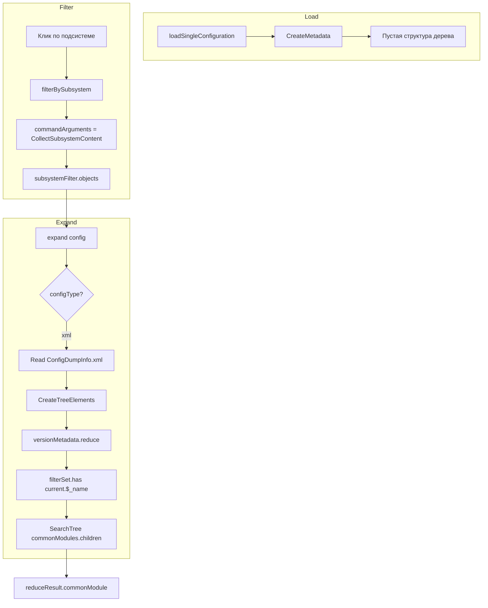

# Анализ: фильтр подсистемы и общие модули (XML)

## Поток данных при построении дерева по XML




## Ключевые точки

### 1. Источник фильтра (commandArguments)

- **Файл:** [src/metadataView.ts](src/metadataView.ts)
- **Строки:** 1049–1068, 2747–2751

При клике по подсистеме `filterBySubsystem` берёт `item.command.arguments` — это результат `CollectSubsystemContent`. Для XML-формата `commandArguments` задаются в `GetSubsystemChildren` (стр. 2751).

### 2. CollectSubsystemContent

- **Файл:** [src/metadataView.ts](src/metadataView.ts)
- **Строки:** 2759–2932

Читает XML подсистемы (`Subsystems/.../Subsystems/...xml`), парсит `Content` (`xr:Item`), извлекает строки вида `CommonModule.ibs_...`, добавляет вложенные подсистемы рекурсивно. Логи показывают, что CommonModule в результат попадают.

### 3. CreateTreeElements и фильтрация

- **Файл:** [src/metadataView.ts](src/metadataView.ts)
- **Строки:** 2082–2195, 2171–2181

```ts
const versionMetadata = metadataFile.ConfigDumpInfo.ConfigVersions.Metadata;
const filterSet = new Set(subsystemFilter.map(s => (s ?? '').trim()).filter(Boolean));
// ...
if (filterSet && !filterSet.has((current.$_name ?? '').trim())) return previous;
// ...
case current.$_name.startsWith('CommonModule.'):
  previous.commonModule.push(GetTreeItem(...));
```

Общие модули попадают в дерево только если `current.$_name` есть в `filterSet`.

### 4. ConfigDumpInfo и versionMetadata

- **Файл:** [src/metadataView.ts](src/metadataView.ts)
- **Строки:** 1522–1543, 2083

`versionMetadata` берётся из `ConfigDumpInfo.ConfigVersions.Metadata`. Парсер использует `isArray: ['ConfigDumpInfo.ConfigVersions.Metadata.Metadata']`.

## Подтверждение: проект XML (не EDT)

- Пользователь подтвердил: проект не EDT.
- Используется путь `metadataView.ts` → `CreateTreeElements`, `CollectSubsystemContent`, `GetSubsystemChildren`.
- EDT-путь ([edt.ts](src/ConfigurationFormats/edt.ts)) не применяется.

## Возможные причины

### A. Формат Content в E:\DATA1C\RZDZUP\src\cf (проверено)

- **Фактический формат:** `<xr:Item xsi:type="xr:MDObjectRef">CommonModule.ibs_МодульПремированияРасширенный</xr:Item>`
- Ссылка в **тексте элемента** (`#text`), не в атрибуте `xr:ref`.
- ConfigDumpInfo: `<Metadata name="CommonModule.ibs_МодульПремированияРасширенный" ...>` — формат совпадает.
- Код уже проверяет `contentElem["#text"]` первым — для этого формата должно работать.

### A2. **Ошибка пути к вложенной подсистеме** (вероятная причина)

Фильтр может применяться и по родительской, и по вложенной подсистеме отдельно.

**Фильтр по родительской подсистеме** (напр. ibs_РасчетПоказателейПремирования):

- `treeItemPath` = `cf/Subsystems/ibs_РасчетПоказателейПремирования` — путь верный.
- Рекурсивная агрегация (стр. 2899): `nestedSubsystemPath = subsystemPath + '/Subsystems/' + childName` — путь к вложенной подсистеме формируется корректно.
- **Работает:** Content родителя + Content вложенных подсистем (в т.ч. CommonModule) попадают в фильтр.

**Фильтр по вложенной подсистеме** (напр. ibs_НастройкиРасчетаПоказателей):

- `treeItemPath` формируется в GetSubsystemChildren (стр. 2750): `CreatePath(m.$_name).replace(/\./g, '/')`.
- Для `Subsystem.A.B` получается `Subsystems/A/B`, а нужно `Subsystems/A/Subsystems/B`.
- **Не работает:** файл не находится → Content не читается → CommonModule не попадают в фильтр.

**Исправление:** в GetSubsystemChildren при формировании `treeItemPath` для вложенных подсистем вставлять `Subsystems/` между уровнями иерархии.

### B. Различие форматов имён

- ConfigDumpInfo: `$_name` (например, `CommonModule.ibs_Модуль...`).
- Content подсистемы: `CommonModule.ibs_Модуль...`.
- Если в ConfigDumpInfo другой регистр или префикс (`commonModule`, `COMMONMODULE` и т.п.), `filterSet.has()` не сработает.

### C. Структура ConfigDumpInfo

- Интерфейс: [src/metadataInterfaces.ts](src/metadataInterfaces.ts) 6–12  
- `ConfigVersion.Metadata: VersionMetadata[]` — ожидается массив объектов верхнего уровня.
- Если в 1С используется вложенная структура (`Metadata.Metadata`), путь `ConfigVersions.Metadata` может указывать не на массив объектов, а на обёртку. Тогда `versionMetadata` будет не тем массивом, и CommonModule в нём не окажутся.

### D. Кэш

- **Файл:** [src/metadataView.ts](src/metadataView.ts) 1457–1492  
- Fingerprint включает фильтр: `sf:${currentFilter.join(',')}`.
- Устаревший кэш с другим fingerprint может подставлять дерево без учёта текущего фильтра.

### E. Ошибка в reduceResult

- **Строка 2479:** `reduceResult.сhartOfCharacteristicTypes` — возможна кириллическая `с` вместо латинской `c` (опечатка).
- К commonModule это не относится, но указывает на возможные опечатки в именах полей.

## Рекомендуемые шаги диагностики

1. **Проверить versionMetadata**
  В `CreateTreeElements` временно логировать:
  - `versionMetadata.filter(m => m.$_name.startsWith('CommonModule.')).length`
  - несколько примеров `$_name` для CommonModule.
2. **Проверить filterSet и сравнение**
  Логировать:
  - `filterSet.size`
  - примеры из `filterSet` (первые 5–10)
  - для каждого CommonModule: `current.$_name`, `filterSet.has(current.$_name.trim())`.
3. **Проверить структуру ConfigDumpInfo**
  Вывести `Object.keys(metadataFile.ConfigDumpInfo.ConfigVersions)` и структуру `Metadata`, чтобы убедиться, что `versionMetadata` — массив объектов верхнего уровня.

## План исправлений

1. **Исправить путь к вложенной подсистеме** — [metadataView.ts](src/metadataView.ts) GetSubsystemChildren ~2750: при формировании `treeItemPath` для вложенных подсистем вставлять `Subsystems/` между уровнями. Например: `Subsystem.A.B` → `Subsystems/A/Subsystems/B`, а не `Subsystems/A/B`.
2. **Если несовпадение форматов** — нормализовать имена при сравнении (регистр, trim, префиксы).
3. **Если неверная структура ConfigDumpInfo** — скорректировать путь к массиву метаданных.
4. **Если кэш** — инвалидировать кэш при смене фильтра или проверить расчёт fingerprint.

