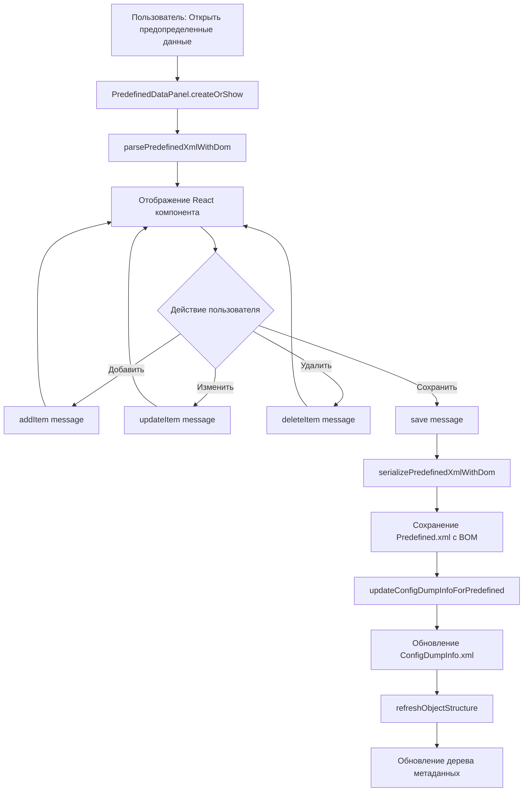

# План: Редактор предопределенных элементов

## Цель

Преобразовать панель просмотра предопределенных элементов в полноценный редактор с возможностью:

- Добавления новых предопределенных элементов
- Редактирования существующих элементов
- Удаления элементов
- Автоматического обновления Predefined.xml через xmldom
- Автоматического обновления ConfigDumpInfo.xml (добавление/обновление записи .Predefined)

## Архитектура решения

### Текущее состояние

- `PredefinedDataPanel` - статическая HTML панель только для просмотра
- Парсинг через `fast-xml-parser` (не сохраняет структуру)
- Нет возможности редактирования
- Нет обновления ConfigDumpInfo.xml

### Предлагаемое решение

1. Преобразовать `PredefinedDataPanel` в полноценный React-компонент (аналогично `MetadataPanel`)
2. Использовать xmldom для парсинга и сохранения Predefined.xml
3. Реализовать CRUD операции через webview messages
4. Автоматически обновлять ConfigDumpInfo.xml при изменениях

## Реализация

### 1. Создание парсера Predefined.xml через xmldom

**Файл:** [`src/xmlParsers/predefinedParser.ts`](src/xmlParsers/predefinedParser.ts)

- Добавить функцию `parsePredefinedXmlWithDom(xmlPath: string): Promise<{ items: PredefinedDataItem[], originalXml: string }>`
- Использовать `DOMParser` из `@xmldom/xmldom`
- Сохранять `_originalXml` для последующего сохранения структуры
- Парсить структуру: `<PredefinedData><Item><Name>...</Name><Code>...</Code><Description>...</Description><IsFolder>...</IsFolder><ChildItems>...</ChildItems></Item></PredefinedData>`

### 2. Создание сериализатора Predefined.xml через xmldom

**Файл:** [`src/xmlParsers/predefinedSerializer.ts`](src/xmlParsers/predefinedSerializer.ts) (новый файл)

- Функция `serializePredefinedXmlWithDom(originalXml: string, items: PredefinedDataItem[]): string`
- Использовать `DOMParser` для парсинга исходного XML
- Использовать `XMLSerializer` для сериализации
- Сохранять структуру и форматирование исходного XML
- Добавлять BOM при сохранении: `Buffer.from([0xEF, 0xBB, 0xBF])`

### 3. Преобразование PredefinedDataPanel в React-компонент

**Файл:** [`src/predefinedDataPanel.ts`](src/predefinedDataPanel.ts)

- Переделать на класс с методами `createOrShow()`, `handleMessage()`
- Использовать React webview (аналогично `MetadataPanel`)
- Добавить обработку сообщений:
- `addItem` - добавление элемента
- `updateItem` - обновление элемента
- `deleteItem` - удаление элемента
- `save` - сохранение изменений

**Файл:** [`src/webview/components/PredefinedEditor/PredefinedEditorApp.tsx`](src/webview/components/PredefinedEditor/PredefinedEditorApp.tsx) (новый файл)

- React компонент для редактирования предопределенных элементов
- Таблица с возможностью редактирования: Name, Code, Description, IsFolder
- Кнопки: Добавить, Изменить, Удалить, Сохранить
- Поддержка иерархической структуры (ChildItems)
- Drag & drop для изменения порядка (опционально)

### 4. Обновление ConfigDumpInfo.xml

**Файл:** [`src/utils/configDumpInfoUpdater.ts`](src/utils/configDumpInfoUpdater.ts) (новый файл)

- Функция `updateConfigDumpInfoForPredefined(params: { configDumpInfoPath: string, objectType: string, objectName: string, predefinedId?: string }): Promise<{ updated: boolean, id: string }>`
- Использовать xmldom для парсинга ConfigDumpInfo.xml
- Найти или создать запись `<Metadata name="Catalog.Номенклатура.Predefined" ... />`
- Генерировать UUID с суффиксом `.1c` для нового ID: `randomUUID() + '.1c'`
- Обновлять `configVersion` (32-символьная hex строка, генерируется случайно)
- Если записи нет - добавить перед закрывающим тегом объекта или в конец массива Metadata

### 5. Интеграция сохранения

**Файл:** [`src/predefinedDataPanel.ts`](src/predefinedDataPanel.ts)В методе `handleMessage` для типа `save`:

1. Вызвать `serializePredefinedXmlWithDom()` для сохранения Predefined.xml
2. Сохранить файл с BOM
3. Вызвать `updateConfigDumpInfoForPredefined()` для обновления ConfigDumpInfo.xml
4. Обновить дерево метаданных через `metadataViewer.refreshObjectStructure`
5. Показать сообщение об успехе

### 6. Обновление интерфейсов

**Файл:** [`src/predefinedDataInterfaces.ts`](src/predefinedDataInterfaces.ts)

- Добавить поле `id?: string` в `PredefinedDataItem` для отслеживания элементов при редактировании
- Добавить поле `_originalXml?: string` для хранения исходного XML

### 7. Обновление команды открытия

**Файл:** [`src/metadataView.ts`](src/metadataView.ts)В методе `openPredefinedData`:

- Использовать `parsePredefinedXmlWithDom()` вместо `fast-xml-parser`
- Передавать `originalXml` в панель для последующего сохранения
- Передавать путь к объекту для обновления ConfigDumpInfo.xml

## Структура XML файлов

### Predefined.xml

```xml
<?xml version="1.0" encoding="UTF-8"?>
<PredefinedData xmlns="http://v8.1c.ru/8.1/data/core" xmlns:cfg="http://v8.1c.ru/8.1/data/enterprise/current-config" xmlns:v8="http://v8.1c.ru/8.1/data/core" xmlns:xs="http://www.w3.org/2001/XMLSchema" xmlns:xsi="http://www.w3.org/2001/XMLSchema-instance">
  <Item>
    <Name>Элемент1</Name>
    <Code>001</Code>
    <Description>Описание</Description>
    <IsFolder>false</IsFolder>
    <ChildItems>
      <Item>...</Item>
    </ChildItems>
  </Item>
</PredefinedData>
```


### ConfigDumpInfo.xml

```xml
<Metadata name="Catalog.Номенклатура.Predefined" id="a53f7b6b-7cdb-4a54-9b8c-162cb9cef6c8.1c" configVersion="9fce6c7f6ca6554e9f767a3db0edc59a00000000"/>
```


## Диаграмма потока данных




## Риски и ограничения

1. **Структура XML**: Нужно точно сохранять структуру элементов и атрибутов при редактировании
2. **Иерархия**: Поддержка вложенных элементов (ChildItems) требует рекурсивной обработки
3. **ConfigVersion**: Нужно генерировать правильный формат (32 hex символа)
4. **UUID формат**: Использовать формат с суффиксом `.1c` для ID в ConfigDumpInfo.xml
5. **BOM**: Всегда добавлять BOM при сохранении XML файлов для 1С

## Зависимости