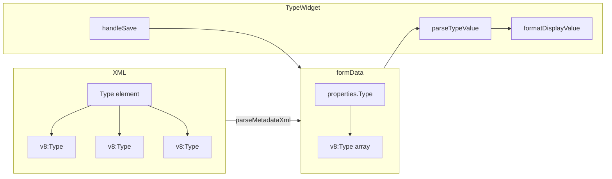

# Редактор типов для определяемых типов (DefinedType)

## Контекст

**Текущее состояние:** Поле «Тип» в определяемых типах отображается как многострочный текст со списком строк вида `cfg:BusinessProcessObject.Задание`, `cfg:BusinessProcessObject.ЗаявкаСотрудникаОтпуск` и т.д.

**Структура XML** (из `E:\DATA1C\RZDZUP\src\cf\DefinedTypes\БизнесПроцессОбъект.xml`):

```xml
<Type>
  <v8:Type>cfg:BusinessProcessObject.Задание</v8:Type>
  <v8:Type>cfg:BusinessProcessObject.ЗаявкаСотрудникаОтпуск</v8:Type>
  ...
</Type>
```

**Формат данных в formData:** `properties.Type = { "v8:Type": ["cfg:...", "cfg:...", ...] }` — массив строк.

## Изменения

### 1. FormEditor — подключить TypeWidget для поля Type при objectType === "DefinedType"

**Файл:** [src/webview/components/FormEditor.tsx](src/webview/components/FormEditor.tsx)

В `uiSchema` (useMemo, ~стр. 155–181) добавить условие:

```ts
if (objectType === 'DefinedType') {
  ui.Type = {
    'ui:widget': 'TypeWidget',
    'ui:options': {
      registers: metadata.registers,
      referenceTypes: metadata.referenceTypes,
      definedTypeMode: true  // режим: только ссылочные типы, массив v8:Type
    }
  };
}
```

### 2. TypeWidget — парсинг формата DefinedType (v8:Type как массив)

**Файл:** [src/webview/widgets/TypeWidget.tsx](src/webview/widgets/TypeWidget.tsx)

В `parseTypeValue` (после проверки v8:TypeSet, ~стр. 448) добавить ветку:

```ts
// Определяемый тип (DefinedType): { "v8:Type": ["cfg:BusinessProcessObject.Задание", ...] }
if (typeValue['v8:Type'] && Array.isArray(typeValue['v8:Type'])) {
  const parsedTypes: SelectedType[] = [];
  for (const typeStr of typeValue['v8:Type']) {
    const clean = (typeof typeStr === 'string' ? typeStr : String(typeStr)).replace(/^cfg:/, '');
    if (clean.includes('.')) {
      const [prefix, objName] = clean.split('.');
      const label = REF_TYPE_PREFIX_MAP[prefix] ? `${REF_TYPE_PREFIX_MAP[prefix]}.${objName}` : clean;
      parsedTypes.push({ value: clean, category: 'reference', label });
    }
  }
  setSelectedTypes(parsedTypes);
  return;
}
```

### 3. TypeWidget — отображение формата DefinedType

**Файл:** [src/webview/widgets/TypeWidget.tsx](src/webview/widgets/TypeWidget.tsx)

В `formatDisplayValue` (после блока v8:TypeSet, ~стр. 1212) добавить:

```ts
// Массив v8:Type (DefinedType)
if (value['v8:Type'] && Array.isArray(value['v8:Type'])) {
  const parts = value['v8:Type'].map((t: any) => {
    const s = typeof t === 'string' ? t : String(t);
    const clean = s.replace(/^cfg:/, '');
    if (clean.startsWith('DefinedType.')) return clean.replace('DefinedType.', 'ОпределяемыйТип.');
    if (clean.includes('.')) {
      const [prefix, objName] = clean.split('.');
      return REF_TYPE_PREFIX_MAP[prefix] ? `${REF_TYPE_PREFIX_MAP[prefix]}.${objName}` : clean;
    }
    return clean;
  });
  return parts.join(', ');
}
```

### 4. TypeWidget — сохранение в формате v8:Type (массив)

**Файл:** [src/webview/widgets/TypeWidget.tsx](src/webview/widgets/TypeWidget.tsx)

В `handleSave` при множественном выборе: если `options?.definedTypeMode === true` и все типы — ссылочные без квалификаторов, сохранять как `{ 'v8:Type': ['cfg:...', ...] }` вместо `{ Type: [{ Type: '...' }, ...] }` для совместимости с форматом DefinedType.

Текущий формат `{ Type: [...] }` уже поддерживается в [xmlDomUtils.ts](src/utils/xmlDomUtils.ts) (стр. 508–545), но для единообразия с исходным XML предпочтительно использовать `v8:Type`.

## Схема данных



## Риски

- Разные парсеры XML могут давать разные ключи (`v8:Type` vs `Type`). В [metadataParser.ts](src/xmlParsers/metadataParser.ts) (стр. 337–339) для Type сохраняется `val` без `cleanNamespacePrefixes`, поэтому ключ `v8:Type` сохраняется.
- При `definedTypeMode` нужно ограничить выбор только ссылочными типами (BusinessProcessObject, TaskObject, DocumentObject и т.д.), без примитивов — это можно сделать через `ui:options`.

## Дополнительные идеи

- Фильтр типов в `definedTypeMode`: показывать только типы, подходящие для определяемого типа (BusinessProcess, Task, Document и т.п.).
- Сортировка типов в списке при отображении.
