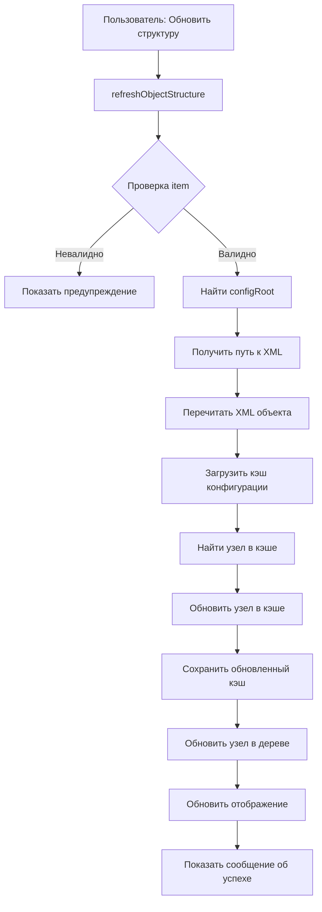

# План: Точечная переиндексация структуры объектов метаданных

## Цель

Добавить возможность точечного обновления структуры конкретного объекта метаданных без полной переиндексации всей конфигурации. Это необходимо, когда внешние системы изменяют файлы проекта (добавляют реквизиты, табличные части, реквизиты табличных частей и т.п.).

## Архитектура решения

### Текущее состояние

- Команда `reindexStructure` выполняет полную пересборку дерева для всей конфигурации
- Команда `refreshObjectByPath` инвалидирует кэш конфигурации, но пересборка происходит только при следующем раскрытии узла
- Дерево строится из `ConfigDumpInfo.xml` через `CreateTreeElements()` при раскрытии узла конфигурации
- Кэш хранится в `MetadataCache` (L1, L2, L3)

### Предлагаемое решение

1. Добавить команду `metadataViewer.refreshObjectStructure` для точечного обновления
2. Реализовать логику перечтения XML объекта и обновления узла в дереве
3. Инвалидировать кэш конфигурации и обновить дерево в реальном времени

**Примечание:** ConfigDumpInfo.xml уже обновлен внешними системами, поэтому его обновление не требуется.

## Реализация

### 1. Добавление команды в package.json

**Файл:** [`package.json`](package.json)

- Добавить команду `metadataViewer.refreshObjectStructure` в `contributes.commands`
- Добавить команду в `contributes.menus.view/item/context` с условием видимости для объектов метаданных:
- `viewItem =~ /object_and_manager/` - для справочников, документов, регистров
- `viewItem =~ /recordset_and_manager/` - для регистров
- `viewItem =~ /object_and_manager_and_predefined/` - для справочников с предопределенными
- Исключить: `viewItem == main` (корневой узел конфигурации)

### 2. Локализация

**Файлы:** [`package.nls.ru.json`](package.nls.ru.json), [`package.nls.en.json`](package.nls.en.json), [`package.nls.json`](package.nls.json)

- Добавить строку: `"1c-metadata-viewer.refreshObjectStructure.title": "Обновить структуру"`

### 3. Реализация метода refreshObjectStructure

**Файл:** [`src/metadataView.ts`](src/metadataView.ts)

#### 3.1. Регистрация команды

В конструкторе `MetadataView` добавить:

```typescript
vscode.commands.registerCommand('metadataViewer.refreshObjectStructure', async (item: TreeItem) => {
  await this.refreshObjectStructure(item);
});
```

#### 3.2. Основной метод refreshObjectStructure

```typescript
private async refreshObjectStructure(item: TreeItem): Promise<void> {
  // 1. Проверка валидности item
  if (!item.path || !item.id) {
    vscode.window.showWarningMessage('Не удалось определить объект для обновления');
    return;
  }

  // 2. Определение конфигурации и типа объекта
  const configRoot = this.findConfigRoot(item);
  const objectPath = item.path;
  const objectXmlPath = this.getObjectXmlPath(objectPath, item.configType);

  // 3. Перечтение XML файла объекта
  const updatedObject = await this.reparseObjectXml(objectXmlPath);

  // 4. Точечное обновление кэша конфигурации
  await this.updateCacheNode(configRoot, item, updatedObject);

  // 5. Обновление узла в текущем дереве (для немедленного отображения)
  await this.updateTreeNode(item, updatedObject);

  // 6. Обновление отображения
  this.dataProvider?.update();
  
  vscode.window.showInformationMessage(`Структура объекта "${item.label}" обновлена`);
}
```

#### 3.3. Вспомогательные методы

**findConfigRoot(item: TreeItem): string**

- Находит корневой путь конфигурации, к которой принадлежит объект
- Ищет родительский узел с `isConfiguration === true`

**getObjectXmlPath(objectPath: string, configType?: string): string**

- Формирует путь к XML файлу объекта
- Учитывает `configType` ('xml' или 'edt')
- Для XML: `{objectPath}.xml`
- Для EDT: `{objectPath}/{objectName}.mdo`

**reparseObjectXml(xmlPath: string): Promise<ParsedMetadataObject>**

- Использует существующий `parseMetadataXml()` из `src/xmlParsers/metadataParser.ts`
- Возвращает обновленную структуру объекта

**searchSerializableTree(node: SerializableTreeNode, matchingId: string): SerializableTreeNode | null**

- Рекурсивная функция поиска узла в `SerializableTreeNode` по ID
- Аналог функции `SearchTree()` для `TreeItem`
- Используется для поиска узла объекта в кэшированном дереве

**updateCacheNode(configRoot: string, item: TreeItem, updatedObject: ParsedMetadataObject): Promise<void>**

- Загружает кэш конфигурации через `cache.read(configRoot)`
- Если кэш отсутствует, пропускает обновление (кэш будет создан при следующем раскрытии)
- Находит узел объекта в кэшированном дереве по `item.id` через `searchSerializableTree()`
- Обновляет структуру узла (children) с учетом новых реквизитов/ТЧ
- Использует логику из `FillObjectItemsByMetadata()` для формирования дочерних элементов
- Сериализует обновленный узел через `serializeTree()`
- Сохраняет обновленный кэш обратно через `cache.write(configRoot, envelope)`

**updateTreeNode(item: TreeItem, updatedObject: ParsedMetadataObject): Promise<void>**

- Находит узел в текущем дереве (tree) по `item.id` через `SearchTree()`
- Обновляет структуру узла (children) с учетом новых реквизитов/ТЧ
- Использует логику из `FillObjectItemsByMetadata()` для формирования дочерних элементов
- Обновляет узел в памяти для немедленного отображения

### 4. Интеграция с существующими функциями

**Файл:** [`src/metadataView.ts`](src/metadataView.ts)

- Использовать `FillObjectItemsByMetadata()` для обновления дочерних элементов узла
- Использовать `CreatePath()` для формирования путей
- Использовать `GetTreeItem()` для создания элементов дерева
- Использовать `serializeTree()` и `hydrateTree()` из `src/runtime/hydrate.ts` для работы с кэшем
- Использовать `SearchTree()` для поиска узлов в дереве
- Создать функцию `searchSerializableTree()` для поиска узлов в `SerializableTreeNode` (аналог `SearchTree`)

### 5. Обработка различных типов объектов

Поддержка всех типов объектов из `CreateTreeElements()`:

- `Catalog.*` - справочники
- `Document.*` - документы  
- `InformationRegister.*` - регистры сведений
- `AccumulationRegister.*` - регистры накопления
- `AccountingRegister.*` - регистры бухгалтерии
- `CalculationRegister.*` - регистры расчета
- `ChartOfAccounts.*` - планы счетов
- `ChartOfCharacteristicTypes.*` - планы видов характеристик
- `ChartOfCalculationTypes.*` - планы видов расчета
- И другие объекты с `context =~ /object_and_manager/`

### 6. Обработка ошибок

- Проверка существования XML файла
- Обработка ошибок парсинга XML
- Логирование в `outputChannel`

## Диаграмма потока данных



## Риски и ограничения

1. **Производительность**: Перечтение XML может быть медленным для больших объектов
2. **Конфликты**: Если объект открыт в редакторе, изменения могут конфликтовать
3. **ConfigDumpInfo**: Предполагается, что ConfigDumpInfo.xml уже обновлен внешними системами, иначе структура может быть неполной

## История реализации

### Проблемы и решения

#### 1. Ошибка "Не удалось определить конфигурацию для объекта"

**Проблема:** При нажатии "Обновить структуру" возникала ошибка "Не удалось определить конфигурацию для объекта".

**Причина:** Метод `findConfigRoot()` искал конфигурацию только через `parentId`, что не работало, если структура дерева не была полностью загружена или `parentId` не был установлен.

**Решение:** Переработан метод `findConfigRoot()`:

- Сначала ищет конфигурацию по пути объекта (как в `refreshObjectByPath`)
- Проверяет, начинается ли путь объекта с пути конфигурации
- Использует fallback через `parentId`, если поиск по пути не дал результата
- Добавлено логирование для отладки

**Код:**

```typescript
private findConfigRoot(item: TreeItem): string | null {
  if (!item.path) return null;
  const normalized = item.path.replace(/\\/g, '/');
  
  // Ищем конфигурацию по пути
  for (const cfg of tree[0].children) {
    if (!cfg.path || !cfg.isConfiguration) continue;
    const cfgPath = cfg.path.replace(/\\/g, '/');
    if (normalized.startsWith(cfgPath + '/') || normalized === cfgPath) {
      return cfgPath;
    }
  }
  
  // Fallback через parentId
  // ...
}
```

#### 2. Объект не находился в ConfigDumpInfo.xml

**Проблема:** Объект не находился в `ConfigDumpInfo.xml`, хотя он там был. В логах: "Объект Документ.РасходнаяНакладная не найден в ConfigDumpInfo.xml".

**Причина:**

- Парсер `parseMetadataXml()` преобразует английские типы в русские (`Document` -> `Документ`)
- В `ConfigDumpInfo.xml` имена объектов всегда с английским префиксом (`Document.РасходнаяНакладная`)
- Поиск выполнялся по русскому имени (`Документ.РасходнаяНакладная`), которого нет в файле

**Решение:**

- Использован централизованный словарь `METADATA_TYPES` из `src/Metadata/metadata-types.ts`
- Добавлено преобразование русского типа в английский перед поиском в `ConfigDumpInfo.xml`
- Исправлено чтение `ConfigDumpInfo.xml` - используется `vscode.Uri.file()` для абсолютного пути

**Код:**

```typescript
// Используем централизованный словарь METADATA_TYPES
const metadataType = METADATA_TYPES.find(m => m.displayName === updatedObject.objectType);
const objectTypeEn = metadataType ? metadataType.type : updatedObject.objectType;
const objectName = `${objectTypeEn}.${updatedObject.name}`;

const versionMetadata = typedResult.ConfigDumpInfo.ConfigVersions.Metadata.find(
  m => m.$_name === objectName
);
```

**Важно:** Обнаружен и использован централизованный словарь `METADATA_TYPES`, который уже существовал в проекте. Это позволило избежать дублирования кода и использовать единый источник истины для преобразования типов.

#### 3. Формы не обновлялись в дереве

**Проблема:** Реквизиты успешно обновлялись, но новые формы не появлялись в дереве метаданных после обновления структуры.

**Причина:**

- Метод `getAttributeReduceResult()` использовал только `versionMetadata.Metadata` (дочерние элементы объекта)
- Формы и макеты находятся на том же уровне, что и сам объект в `ConfigDumpInfo.xml`, а не внутри `versionMetadata.Metadata`
- `versionMetadata.Metadata` содержит только дочерние элементы (реквизиты, табличные части, реквизиты табличных частей)

**Решение:**

- Переработан метод `getAttributeReduceResult()` для чтения всего `ConfigDumpInfo.xml`
- Поиск форм и макетов выполняется во всем массиве `ConfigDumpInfo.ConfigVersions.Metadata`
- Фильтрация по имени объекта для поиска только форм/макетов данного объекта
- Логика соответствует функции `CreateTreeElements()`, которая используется при первоначальной загрузке дерева

**Код:**

```typescript
private async getAttributeReduceResult(configRoot: string, versionMetadata: VersionMetadata): Promise<MetadataDictionaries> {
  // Читаем весь ConfigDumpInfo.xml
  const configDumpInfoPath = pathJoin(configRoot, 'ConfigDumpInfo.xml');
  const configDumpInfoUri = vscode.Uri.file(configDumpInfoPath);
  const configXml = await vscode.workspace.fs.readFile(configDumpInfoUri);
  
  // Парсим весь файл
  const result = parser.parse(Buffer.from(configXml));
  const typedResult = result as MetadataFile;
  
  // Используем весь массив метаданных
  const allMetadata = typedResult.ConfigDumpInfo.ConfigVersions.Metadata;
  const objectName = versionMetadata.$_name;
  
  // Ищем формы и макеты для данного объекта во всем массиве
  for (const current of allMetadata) {
    const currentObjectName = current.$_name.split('.').slice(0, 2).join('.');
    if (currentObjectName !== objectName) continue;
    
    // Обработка форм и макетов...
  }
}
```

### Дополнительные улучшения

1. **Логирование:** Добавлено детальное логирование для отладки:

   - В `getVersionMetadataForObject()` - логирование поиска объекта
   - В `getAttributeReduceResult()` - логирование найденных форм и макетов
   - В `updateCacheNode()` и `updateTreeNode()` - логирование структуры дочерних элементов
   - В `FillCommonItems()` - логирование доступных форм

2. **Обработка ошибок:** Добавлена обработка ошибок с логированием в `outputChannel` для всех методов

3. **Поддержка перечислений:** Добавлена команда "Обновить структуру" для объектов типа "Перечисление" (`Enum`)

### Итоговая структура методов

1. **refreshObjectStructure()** - основной метод обновления структуры
2. **findConfigRoot()** - поиск конфигурации по пути объекта
3. **getObjectXmlPath()** - формирование пути к XML файлу объекта
4. **reparseObjectXml()** - перечтение XML файла объекта
5. **getVersionMetadataForObject()** - получение VersionMetadata из ConfigDumpInfo.xml с преобразованием типов
6. **getAttributeReduceResult()** - получение форм и макетов из всего ConfigDumpInfo.xml
7. **createChildrenForObject()** - создание дочерних элементов для объекта на основе его типа
8. **updateCacheNode()** - точечное обновление узла в кэше
9. **updateTreeNode()** - обновление узла в текущем дереве
10. **searchSerializableTree()** - поиск узла в SerializableTreeNode для работы с кэшем