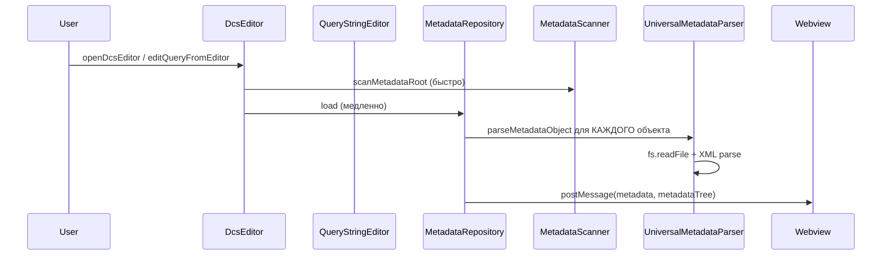

# Анализ открытия редактора запросов и варианты ускорения

## 1. Текущая архитектура и узкие места

### 1.1 Поток открытия редактора




### 1.2 Основные узкие места


| Компонент                                                                                      | Операция                     | Проблема                                                                                  |
| ---------------------------------------------------------------------------------------------- | ---------------------------- | ----------------------------------------------------------------------------------------- |
| [MetadataRepository.load()](src/metadata_utils/MetadataRepository.ts)                          | Парсинг всех объектов        | Последовательный цикл `for (ref of scan.objects)` — парсит 500–5000+ XML файлов           |
| [UniversalMetadataParser.parseMetadataObject()](src/metadata_utils/UniversalMetadataParser.ts) | Чтение и парсинг каждого XML | `fs.readFile` + `fast-xml-parser` для каждого объекта; опционально `Predefined.xml`       |
| [MetadataRepository](src/metadata_utils/MetadataRepository.ts)                                 | Кэширование                  | Только in-memory, TTL 30 сек — при закрытии панели кэш сбрасывается                       |
| [DcsEditor.openEditor()](src/dcsEditor.ts)                                                     | Дополнительный парсинг       | `parseReportXmlForDcs` (Report.xml + Template.xml) выполняется перед загрузкой метаданных |


### 1.3 Дублирование кэшей

- **MetadataView** использует [MetadataCache](src/runtime/MetadataCache.ts) (L1/L2/L3, диск, workspaceState).
- **DcsEditor** и **QueryStringEditor** используют [MetadataRepository](src/metadata_utils/MetadataRepository.ts) — только in-memory, 30 сек.
- Форматы разные: MetadataCache хранит `SerializableTreeNode` (дерево Explorer), MetadataRepository — `ParsedMetadataObject[]` + `MetadataTreeNode` (дерево с insertText, атрибутами, ТЧ).

---

## 2. Варианты ускорения

### Вариант A: Параллельный парсинг XML (низкий риск)

**Суть:** Заменить последовательный `for` на `Promise.all` с ограничением concurrency (например, 10–20 параллельных чтений).

**Файл:** [MetadataRepository.ts](src/metadata_utils/MetadataRepository.ts), строки 32–39.

**Изменение:**

```typescript
// Было:
for (const ref of scan.objects) {
  const obj = await parseMetadataObject(ref);
  parsed.push(obj);
}

// Стало: batch-параллелизм (например, по 16 объектов)
const BATCH = 16;
for (let i = 0; i < scan.objects.length; i += BATCH) {
  const batch = scan.objects.slice(i, i + BATCH);
  const results = await Promise.all(batch.map(ref => parseMetadataObject(ref)));
  parsed.push(...results);
}
```

**Ожидаемый эффект:** Ускорение в 2–4 раза на многоядерных системах при большом количестве объектов.

**Риски:** Пики памяти при одновременном парсинге многих XML; при необходимости — уменьшить BATCH.

---

### Вариант B: Дисковый кэш для MetadataRepository (средний риск)

**Суть:** Добавить L3-кэш по аналогии с MetadataCache — сохранять результат `MetadataRepository.load()` в JSON на диск (globalStorageUri), инвалидировать по fingerprint (ConfigDumpInfo.xml, Configuration.xml).

**Файлы:** [MetadataRepository.ts](src/metadata_utils/MetadataRepository.ts), новый модуль кэша или расширение [MetadataCache](src/runtime/MetadataCache.ts).

**Структура:**

- Ключ: `sha1(configRoot + fingerprint)`
- Значение: `{ objects, tree }` в JSON
- Инвалидация: при изменении ConfigDumpInfo.xml / Configuration.xml (или по команде «Переиндексировать»)

**Ожидаемый эффект:** Повторное открытие редактора — почти мгновенно (чтение JSON вместо парсинга сотен XML).

**Риски:** Несовместимость формата при обновлении структуры; нужна версия кэша.

---

### Вариант C: Ленивая загрузка дерева метаданных (средний риск)

**Суть:** Сначала отдавать в webview только `metadata` (registers, referenceTypes) — его даёт `scanMetadataRoot` без парсинга XML. Дерево `metadataTree` подгружать асинхронно после отображения редактора.

**Файлы:** [DcsEditor.ts](src/dcsEditor.ts), [QueryStringEditor.ts](src/queryStringEditor.ts), [DcsEditorApp.tsx](src/webview/components/DcsEditor/DcsEditorApp.tsx), [StandaloneQueryEditor.tsx](src/webview/components/StandaloneQueryEditor.tsx).

**Поток:**

1. `postMessage({ metadata, metadataTree: null })` — редактор открывается сразу с автодополнением (registers, referenceTypes).
2. В фоне: `loadMetadataTreeForWebview()` → `postMessage({ type: 'metadataTreeReady', metadataTree })`.
3. Webview подставляет дерево в панель навигатора при получении.

**Ожидаемый эффект:** Редактор становится интерактивным на 1–3 секунды раньше; дерево появляется с небольшой задержкой.

**Риски:** Нужно доработать React-компоненты для обработки `metadataTree: null` и последующего обновления.

---

### Вариант D: Объединение с MetadataCache (высокий риск)

**Суть:** Расширить MetadataCache (или создать отдельный QueryMetadataCache) для хранения дерева в формате QueryMetadataNode. DcsEditor и QueryStringEditor читают из этого кэша вместо MetadataRepository.

**Проблема:** MetadataCache хранит `SerializableTreeNode` (дерево Explorer), а редактору нужен `QueryMetadataNode` (kind, insertText, атрибуты, ТЧ, виртуальные таблицы). Потребуется либо:

- хранить оба формата, либо
- строить QueryMetadataNode из ParsedMetadataObject и кэшировать его.

**Ожидаемый эффект:** Единый кэш, меньше дублирования, ускорение при уже загруженной конфигурации.

**Риски:** Существенный рефакторинг; возможные расхождения между деревом Explorer и деревом редактора запросов.

---

### Вариант E: Облегчённый парсинг для навигатора (средний риск)

**Суть:** Для дерева навигатора не парсить полную структуру (ChildObjects, атрибуты, ТЧ) — только имя объекта и тип. Детали подгружать по требованию при раскрытии узла или при первом использовании в автодополнении.

**Файлы:** [UniversalMetadataParser.ts](src/metadata_utils/UniversalMetadataParser.ts), [MetadataRepository.ts](src/metadata_utils/MetadataRepository.ts).

**Реализация:** Добавить режим `parseMetadataObject(ref, { lightweight: true })`, который читает только Properties/Name и не обходит ChildObjects. Для полного дерева — парсить по требованию или в фоне.

**Ожидаемый эффект:** Существенное ускорение первой загрузки (в 3–5 раз меньше работы на объект).

**Риски:** Сложнее логика; возможны задержки при раскрытии узлов.

---

### Вариант F: Кэш только для scanMetadataRoot (низкий риск)

**Суть:** `scanMetadataRoot` уже быстрый (только readdir), но `scanMetadataForWebview` использует его результат для построения `registers` и `referenceTypes`. Эти списки можно кэшировать на диск вместе с деревом — они маленькие и редко меняются.

**Примечание:** Основная задержка — в `loadMetadataTreeForWebview` (MetadataRepository.load), а не в scanMetadataForWebview. Этот вариант даёт небольшой выигрыш, но прост в реализации.

---

## 3. Рекомендуемая последовательность внедрения

1. **Вариант A** (параллельный парсинг) — быстрая реализация, заметный эффект, минимальные риски.
2. **Вариант C** (ленивая загрузка дерева) — улучшает воспринимаемую скорость, редактор открывается быстрее.
3. **Вариант B** (дисковый кэш MetadataRepository) — максимальный эффект при повторных открытиях.

Варианты D и E — более сложные, их целесообразно рассматривать после A, B, C.

---

## 4. Дополнительные замеры

Для количественной оценки стоит добавить логирование времени:

- В [DcsEditor.openEditor()](src/dcsEditor.ts): `parseReportXmlForDcs`, `scanMetadataForWebview`, `loadMetadataTreeForWebview`.
- В [MetadataRepository.load()](src/metadata_utils/MetadataRepository.ts): общее время и количество объектов.

Это позволит проверить эффект от изменений и выявить оставшиеся узкие места.