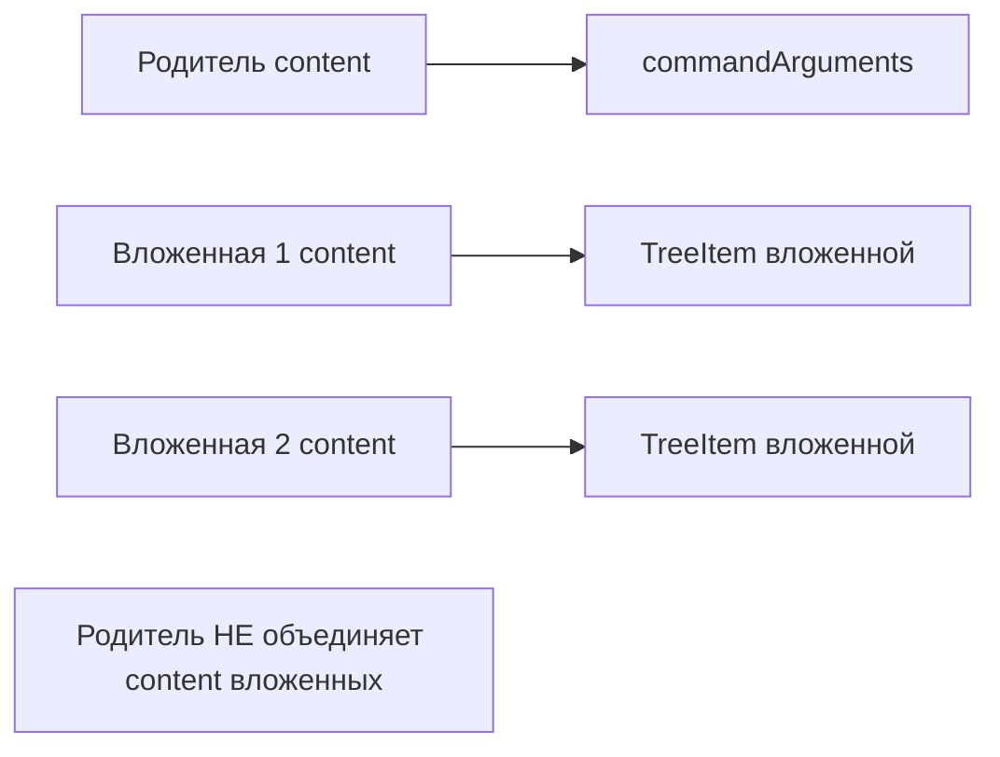
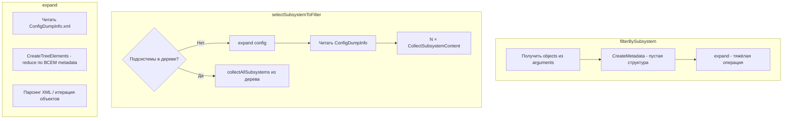

# План: отображение общих модулей при фильтре по подсистеме

## Корневая причина

Общие модули в 1С обычно находятся во **вложенных подсистемах**, а не в родительской. При выборе родительской подсистемы фильтр должен включать Content самой подсистемы **и** Content всех вложенных подсистем (ChildObjects/Subsystem).

**Пример:** подсистема `ibs_РасчетПоказателейПремирования` имеет Content из 14 объектов (без CommonModule). Её дочерняя `ibs_НастройкиРасчетаПоказателей` содержит 7 CommonModule. При фильтре по родителю общие модули должны отображаться.

## Обнаруженные проблемы

### 1. XML-формат: неверный путь для вложенных подсистем в selectSubsystemToFilter

**Файл:** [src/metadataView.ts](src/metadataView.ts)

В `selectSubsystemToFilter` для вложенных подсистем (строки 1267, 1299-1300) используется:

- `CreatePath(subMetadata.$_name)` → для `Subsystem.A.B` даёт `Subsystems/A.B` (точка остаётся)
- `createSubsystemPathForCollect(nestedSub.$_name)` → даёт `Subsystems/A/Subsystems/B` (верно)

Для **корневых** подсистем (стр. 1267): `CreatePath("Subsystem.Зарплата")` = `Subsystems/Зарплата` — верно.

Для **вложенных** (стр. 1268): при создании из `subsystemMetadata` берутся только подсистемы с `nameParts.length === 2`, т.е. только корневые. Вложенные добавляются через `addNestedSubsystems`, где уже используется `createSubsystemPathForCollect` (стр. 1299) — путь верный.

Проверка GetSubsystemChildren (стр. 2750): используется `createSubsystemPathForCollect(m.$_name)` — путь верный для вложенных.

### 2. EDT-формат: Content вложенных не объединяется с родителем

**Файл:** [src/ConfigurationFormats/edt.ts](src/ConfigurationFormats/edt.ts)

В `getSubsystemChildren` (строки 412-478):

- `subsystemContent` строится из `obj.content` (текущая подсистема) и path-based имён
- Для каждой вложенной подсистемы вызывается `fs.promises.readFile().then(...)` — **асинхронно**
- Рекурсивный `getSubsystemChildren` возвращает `{ chilldren, content }`, но `content` вложенной **не добавляется** в родительский `subsystemContent`
- Родитель возвращает `content` без объектов из вложенных подсистем




### 3. Парсинг ChildObjects для EDT .mdo и XML

**XML (CollectSubsystemContent):** используется `result.MetaDataObject?.Subsystem?.ChildObjects` — подходит для XML export. Для .mdo EDT структура может быть `mdclass:Subsystem.childObjects` или иной. Сейчас поддерживаются оба варианта Content, но ChildObjects проверяется только в `MetaDataObject`-ветке.

**EDT .mdo:** в `getSubsystemChildren` используется `obj.subsystems` — структура EDT. Проблема не в парсинге, а в отсутствии объединения content.

## План исправлений

### Исправление 1: EDT — объединение Content вложенных подсистем с родителем

**Файл:** [src/ConfigurationFormats/edt.ts](src/ConfigurationFormats/edt.ts)

1. Сделать `getSubsystemChildren` **асинхронной** (async).
2. Для каждой вложенной подсистемы в `obj.subsystems`:
  - await чтение файла .mdo
  - Рекурсивно вызвать `getSubsystemChildren` (await)
  - Добавить `content` вложенной в `subsystemContent` родителя (объединение без дубликатов)
3. В `createElement` для Subsystem: await `getSubsystemChildren` перед созданием TreeItem.

Ключевой фрагмент (псевдокод):

```ts
// В getSubsystemChildren - добавить await и merge
for (const subsystem of obj.subsystems) {
  const data = await fs.promises.readFile(fileName.fsPath);
  const parsed = parser.parse(data);
  const elementObject = parsed[Object.keys(parsed)[1]];
  const { chilldren, content } = await this.getSubsystemChildren(elementObject, folderUri, subPath);
  for (const item of content) {
    if (!subsystemContent.includes(item)) subsystemContent.push(item);
  }
  subtreeItems.push(GetTreeItem(..., { commandArguments: content }));
}
return { chilldren: subtreeItems, content: subsystemContent };
```

### Исправление 2: XML — проверить поддержку ChildObjects для .mdo (если используются пути EDT)

**Файл:** [src/metadataView.ts](src/metadataView.ts), `CollectSubsystemContent`

Добавить чтение ChildObjects для EDT .mdo:

```ts
const childObjects = result.MetaDataObject?.Subsystem?.ChildObjects 
  ?? (result as any)['mdclass:Subsystem']?.childObjects
  ?? (result as any)['mdclass:Subsystem']?.ChildObjects;
```

Также рассмотреть попытку чтения `.mdo` файлов, если `.xml` не найден (для проектов со смешанной структурой).

### Исправление 3: selectSubsystemToFilter — путь для корневых подсистем

В строках 1267-1268 для подсистем из `subsystemMetadata` используется `CreatePath`. Для `Subsystem.Имя` (одноуровневые) CreatePath даёт `Subsystems/Имя` — корректно. Для вложенных в этом цикле нет (они только в addNestedSubsystems). Оставляем как есть или заменяем на `createSubsystemPathForCollect` для единообразия.

## Файлы для изменения


| Файл                                                               | Изменения                                                                                                   |
| ------------------------------------------------------------------ | ----------------------------------------------------------------------------------------------------------- |
| [src/ConfigurationFormats/edt.ts](src/ConfigurationFormats/edt.ts) | `getSubsystemChildren` → async, объединение content вложенных; `createElement` → await getSubsystemChildren |
| [src/metadataView.ts](src/metadataView.ts)                         | Расширить парсинг ChildObjects для mdclass:Subsystem (опционально)                                          |


## Риски

- Асинхронность `getSubsystemChildren` может потребовать изменений в вызывающем коде (`createElement` уже возвращает Promise)
- Циклические ссылки между подсистемами маловероятны, но при глубокой вложенности стоит добавить ограничение глубины рекурсии

## Диагностика (при необходимости)

1. Включить `metadataViewer.debugMode: true`
2. Логи `[CollectSubsystemContent]` покажут кол-во объектов и CommonModule в фильтре
3. При выборе родительской подсистемы проверить, что в commandArguments есть CommonModule из вложенных

---

# Оптимизация: ускорение установки фильтра по подсистеме

## Текущие узкие места




| Этап                                   | Операция                           | Сложность                                   |
| -------------------------------------- | ---------------------------------- | ------------------------------------------- |
| filterBySubsystem                      | expand()                           | O(метаданные) — полная пересборка дерева    |
| selectSubsystemToFilter (дерево пусто) | N × CollectSubsystemContent        | O(N × файлы) — до 50+ синхронных чтений XML |
| expand (XML)                           | CreateTreeElements reduce          | O(M) — M = кол-во объектов в ConfigDumpInfo |
| expand (EDT)                           | createTreeElements + createElement | O(M) + чтение .mdo для каждого объекта      |


## Идеи ускорения

### 1. Кэш CollectSubsystemContent (высокий эффект)

**Суть:** Content подсистем редко меняется. Кэшировать результат `CollectSubsystemContent(rootPath, treeItemPath)` в `Map<string, string[]>`.

**Ключ:** `rootPath.fsPath + '|' + treeItemPath`

**Эффект:** При повторном выборе подсистемы (например, в Quick Pick) — 0 чтений файлов. При первом выборе — как сейчас. Инвалидация при изменении файлов подсистем (можно через FileSystemWatcher или при следующем expand).

**Файлы:** `metadataView.ts` — обёртка над CollectSubsystemContent с кэшем.

### 2. Ленивые commandArguments

**Суть:** Не вычислять `commandArguments` при построении списка подсистем. Вычислять только при фактическом выборе подсистемы пользователем.

**Реализация:** В Quick Pick показывать подсистемы без `objectsCount` в description (или показывать «…»). При выборе — вызвать CollectSubsystemContent и передать в filterBySubsystem.

**Эффект:** selectSubsystemToFilter открывается мгновенно, без чтения XML. Задержка только при клике.

**Минус:** Теряется отображение «N объектов» в списке до выбора.

### 3. Использовать дерево вместо ConfigDumpInfo в selectSubsystemToFilter

**Суть:** Если подсистемы уже есть в дереве (после expand), `commandArguments` уже вычислены. Не вызывать CollectSubsystemContent повторно.

**Текущее поведение:** При `allSubsystems.length === 0` (дерево пусто) читается ConfigDumpInfo и для каждой подсистемы вызывается CollectSubsystemContent. Если дерево заполнено — берутся узлы из дерева с готовыми arguments.

**Оптимизация:** Всегда сначала пытаться expand (если ещё не раскрыто) и брать подсистемы из дерева. Fallback на ConfigDumpInfo только если expand не сработал или дерево пусто.

### 4. Параллельное чтение подсистем в selectSubsystemToFilter

**Суть:** При построении списка из ConfigDumpInfo вызывать CollectSubsystemContent параллельно через `Promise.all`.

**Требование:** `CollectSubsystemContent` сделать асинхронной (async) или обернуть в Promise. Сейчас она синхронная.

**Эффект:** Вместо 50 последовательных чтений — 50 параллельных. Ускорение на 5–10× при большом количестве подсистем.

### 5. Индекс Content подсистем при загрузке

**Суть:** При первом expand (или при открытии workspace) — один раз прочитать все XML подсистем и построить индекс `Map<treeItemPath, string[]>`.

**Эффект:** Все последующие вызовы CollectSubsystemContent — O(1) lookup. Первая загрузка чуть дольше.

**Инвалидация:** При изменении `**/Subsystems/**/*.xml` — пересобрать индекс.

### 6. Кэш дерева с фильтром (уже есть)

**Текущее:** fingerprint включает `sf:${currentFilter.join(',')}`. Повторный expand с тем же фильтром берётся из кэша.

**Идея:** Не сбрасывать `element.children = CreateMetadata()` перед expand, если фильтр не изменился. Сейчас при каждом filterBySubsystem дерево обнуляется. Можно проверять: если `subsystemFilter` для этой конфигурации тот же — не обнулять, а сразу expand (кэш сработает).

### 7. EDT: кэширование для createTreeElements

**Текущее:** EDT не использует кэш (TODO в коде). Каждый expand — полный парсинг Configuration.mdo и createElement для каждого объекта.

**Идея:** Добавить кэш для EDT по аналогии с XML (fingerprint + filter).

## Рекомендуемый порядок внедрения

1. **Кэш CollectSubsystemContent** — минимальные изменения, заметный эффект при повторных действиях.
2. **Параллельное чтение** — при переходе CollectSubsystemContent на async (нужно для исправления EDT).
3. **Индекс Content** — если задержки остаются значительными.

