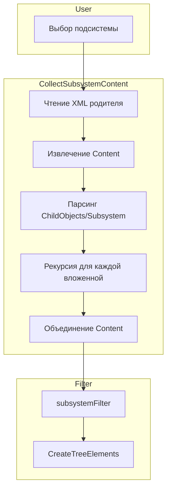

# Фильтрация ролей и общих модулей по подсистеме

## Проблема

При установке фильтра по подсистеме роли и общие модули не фильтруются полностью. **Корневая причина:** подсистемы могут содержать вложенные подсистемы (ChildObjects/Subsystem), а `CollectSubsystemContent` читает только Content выбранной подсистемы, не учитывая Content вложенных.

## Анализ на примере ibs_РасчетПоказателейПремирования

**Структура:**

```
Subsystems/ibs_РасчетПоказателейПремирования.xml
  - Content: 14 объектов (Document, Role x4, ChartOfCharacteristicTypes, Constant, ...) — без CommonModule
  - ChildObjects/Subsystem: ibs_НастройкиРасчетаПоказателей

Subsystems/ibs_РасчетПоказателейПремирования/Subsystems/ibs_НастройкиРасчетаПоказателей.xml
  - Content: 34 объекта, включая Role.ibs_ДобавлениеИзменениеПоказателиПремирования,
    CommonModule.ibs_МодульПремированияРасширенный, CommonModule.ibs_МодульПремированияВызовСервера и др.
  - ChildObjects: пусто
```

При выборе родительской подсистемы `ibs_РасчетПоказателейПремирования` фильтр должен включать объекты из её Content **и** из Content всех вложенных подсистем.

## Поток данных




## Изменения

### 1. Рекурсивная агрегация Content в CollectSubsystemContent (новое)

**Файл:** [src/metadataView.ts](src/metadataView.ts), функция `CollectSubsystemContent` (стр. 2756)

После извлечения Content текущей подсистемы:

1. Парсить `ChildObjects/Subsystem` из результата парсера:
  - `result.MetaDataObject?.Subsystem?.ChildObjects?.Subsystem`
  - Значение может быть строкой (одна подсистема) или массивом строк
2. Для каждой вложенной подсистемы формировать путь:
  - `nestedPath = subsystemPath + '/Subsystems/' + childName`
  - Пример: `Subsystems/ibs_РасчетПоказателейПремирования/Subsystems/ibs_НастройкиРасчетаПоказателей`
3. Рекурсивно вызывать `CollectSubsystemContent(rootPath, configPath + '/' + nestedPath)` для каждой вложенной
4. Объединять результаты: `subsystemContent.push(...nestedContent)` (или через Set для дедупликации)

**Важно:** Путь к вложенной подсистеме должен соответствовать структуре файлов:

- `Subsystems/Parent/Subsystems/Child.xml` (прямой)
- `Subsystems/Parent/Subsystems/Child/Child.xml` (EDT-подпапка)

### 2. Усилить парсинг Content (уже реализовано)

Парсинг Content и варианты ключей уже доработаны в предыдущей итерации.

### 3. Парсер подсистем (уже реализовано)

Опции `textNodeName: '#text'`, `removeNSPrefix: false` уже добавлены.

### 4. EDT-путь (уже реализовано)

Нормализация obj в edt.ts уже добавлена.

## Детали реализации

**Парсинг ChildObjects:**

```ts
const childObjects = result.MetaDataObject?.Subsystem?.ChildObjects;
const childSubsystems = childObjects?.Subsystem ?? childObjects?.['Subsystem'];
const childNames = childSubsystems
  ? (Array.isArray(childSubsystems) ? childSubsystems : [childSubsystems])
      .map((s: any) => typeof s === 'string' ? s : s?.['#text'] ?? s?.text ?? String(s))
      .filter(Boolean)
  : [];
```

**Рекурсивный вызов:**

```ts
for (const childName of childNames) {
  const nestedSubsystemPath = subsystemPath + '/Subsystems/' + childName;
  const nestedPath = configPath ? configPath + '/' + nestedSubsystemPath : nestedSubsystemPath;
  const nestedContent = CollectSubsystemContent(rootPath, nestedPath);
  for (const item of nestedContent) {
    if (!subsystemContent.includes(item)) subsystemContent.push(item);
  }
}
```

## Риски

- Циклические ссылки между подсистемами (маловероятно в 1С)
- Глубоко вложенные подсистемы — ограничить глубину рекурсии при необходимости

